# Telegram IOT Bot
* Python / Broadlink powered Telegram bot
* Control your home/office devices with Telegram


# Table of contents
- [Introduction](#introduction)
- [Requirements](#requirements)
- [Getting Started](#getting-started)
	* [BotFather](#botfather)
	* [Broadlink Devices](#broadlink-devices)
	  * [RM3](#rm3)
	  * [SP2](#sp2)
	* [Rooms, Devices & Commands](#rooms-devices-commands)
	  * [Rooms](#rooms)
	  * [Devices](#devices)
	    * [Type Enums](#type-enums)
	  * [Device's Commands](#device-commands)
	  * [Other Broadlink Devices](#other-broadlink-devices)
	    * [Broadlink Types](#broadlink-types)
	* [Users](#users)
	* [Sample JSON](#sample-jsons)
	* [Learning Commands](#learning-commands)
	* [Usage](#usage)
	  * [Controlling Devices](#controlling-devices)
	  * [Add Users](#add-users)
	  * [Remove Users](#remove-users)
- [Running the application](#run)
- [Screenshots](#screenshots)
- [Videos](#videos)
- [Future features / Improvements](#future)
- [Project Limitation](#limitation)
- [Contributing](#contributing)
- [License](#license)


# Introduction
Control various devices such as (TV, Aircon, Set Top Box) with this Telegram Bot!


### Features
* Supports various household appliances
* Only approved users can use the bot
* In-line keyboard menu to control your devices
* Learn and add commands to JSON file for device's commands
* Add / Delete users
* Query server's last handled request / command


# Requirements
### Requirements
* Python 3.6+
* [Python Telegram Bot](https://python-telegram-bot.org/)
* [Python-Broadlink](https://github.com/mjg59/python-broadlink)
* Supported Broadlink Devices
	* [RM2](http://www.ibroadlink.com/rmMini3/)
	* [SP2](https://www.ibroadlink.com/products/smart-plug)
	* [SP4](https://www.ibroadlink.com/products/smart-plug)
	* [TC2](http://www.ibroadlink.com/tc2/)
	* [RMPro+](http://www.ibroadlink.com/rmPro+/)
	* etc.

### Optional
* [Raspberry PI](https://www.raspberrypi.org/products/)


# Getting Started
### BotFather
* Create new bot in Telegram
1. Find @BotFather in Telegram
1. Type `/help` for commands
1. Key in `/newbot` and save your bot id and secret

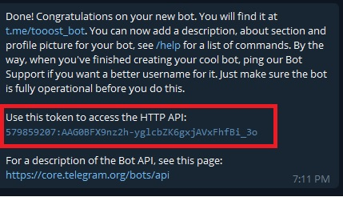

* Populate shortcut commands to your Telegram bot
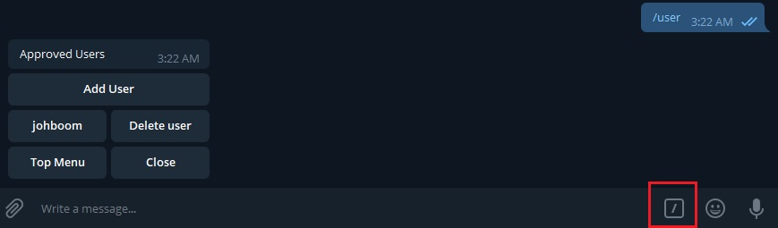
1. Find @BotFather in Telegram
1. Type `/setcommands` in Telegram
1. Paste the following text snippet to Telegram
```
start - list of general commands
ping - returns pong and your user info
status - returns server information
list - returns the list of rooms and devices commands
keyboard - returns keyboard access to rooms commands
user - returns list of approved users with delete option
adduser - Add user conversation (provide both user id and username)
```
4. Success!, Botfather will notify `Success! Command list updated. /help`
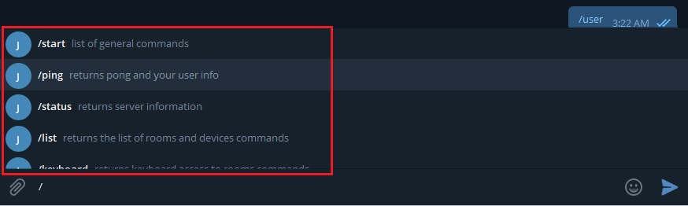

### Broadlink Devices
#### RM3
[Full Manual](http://download.appinthestore.com/201605/Broadlink%20IR%20Remote%20Controller%20Manual.pdf)

* Unbox Device
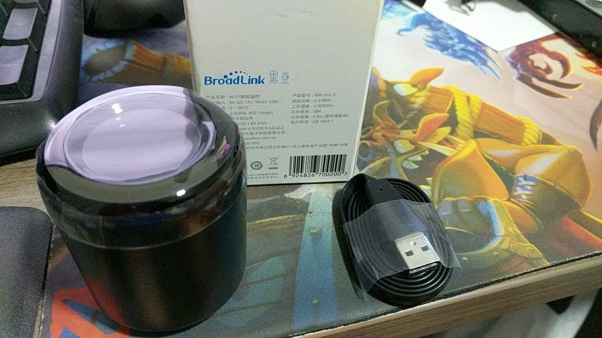

1. USB Cable, RM3 Device
1. Connect RM3 device with power with USB cable

* Install Mobile App and configure RM3 device
1. Install Broadlink's e-Control App [Link](http://www.ibroadlink.com/app/)
2. Press on `+` and then `Add device`
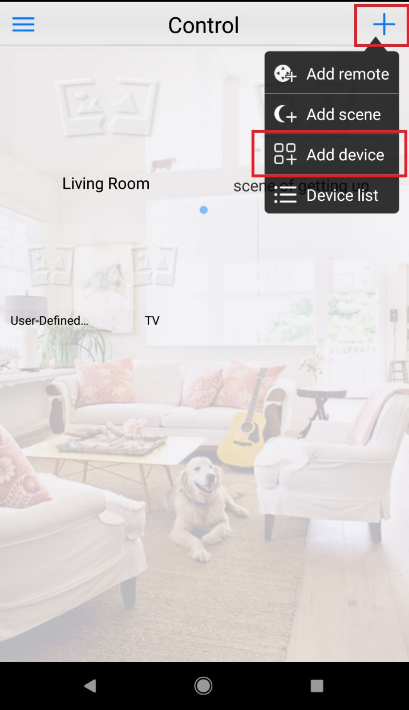
3. Key in your Wifi's ssid and password and press `Configure`
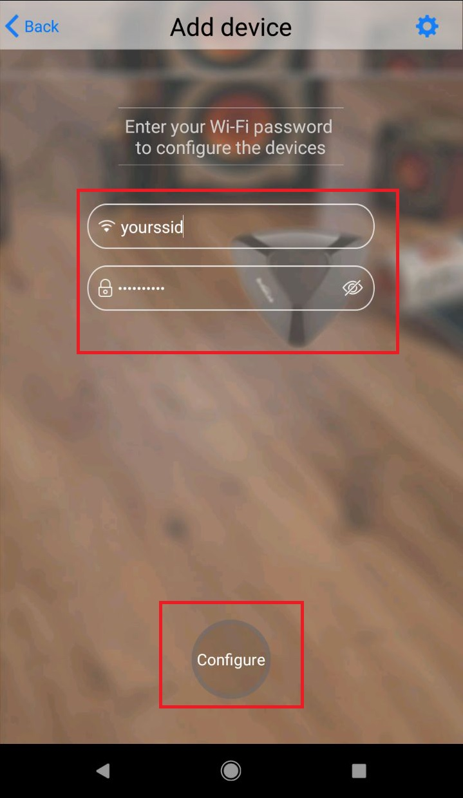
4. When successful, your device will show up in device list with the MAC address(`+` -> Device list)
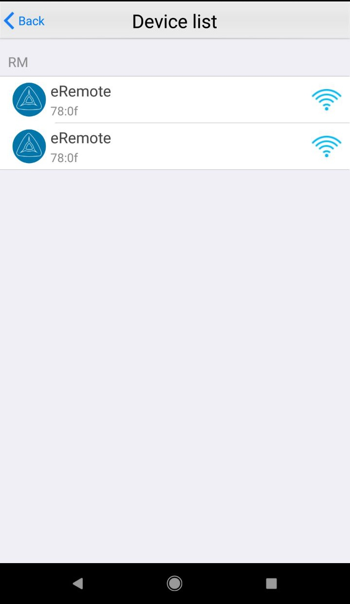

**You may refer to https://github.com/mjg59/python-broadlink#example-use if the above steps did not work**

#### SP2
[Full Manual](https://fccid.io/2AIWOSP2-US/User-Manual/User-Manual-3580152.pdf)

* Unbox Device
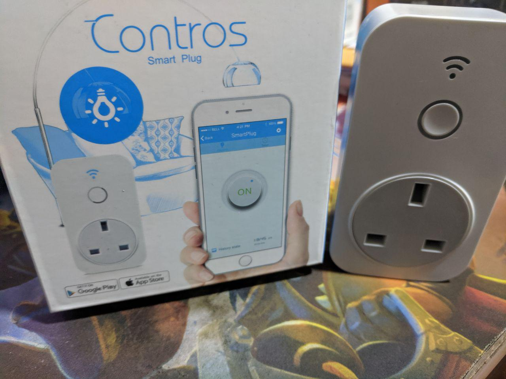

1. SP2 Smart Plug
1. Plug SP2 into socket

* Install Mobile App and configure SP2 device
1. Install Broadlink's e-Control App [Link](http://www.ibroadlink.com/app/)
2. Press on `+` and then `Add device`

3. Key in your Wifi's ssid and password and press `Configure`

4. When successful, your device will show up in device list with the MAC address(`+` -> Device list)
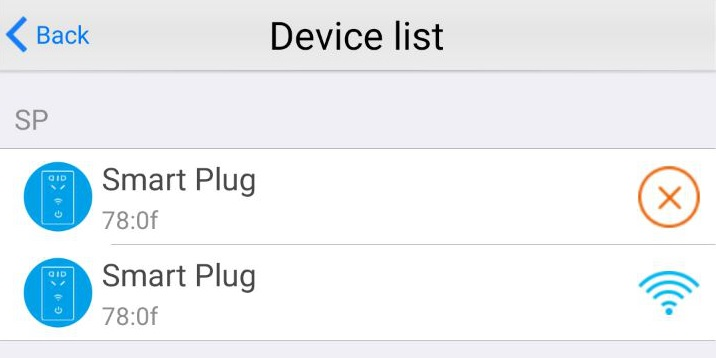

**You may refer to https://github.com/mjg59/python-broadlink#example-use if the above steps did not work**

### Rooms Devices Commands
#### Rooms
* To add a room, use the following JSON format and add it to `devices.json` file
* Supports one RM device per room only
* Add the RM device's MAC address that you are placing in the room (for RMMINI)
(To get device's IP or MAC address, refer to [Learning Commands](#learning-commands))
* MAC address value should be used from the device list from the app (without the colon `:`)
* See [Other Broadlink Devices](#other-broadlink-devices) for more details with adding other Broadlink devices

eg. Adding Office
```
{
	"office": {
		"mac_address": "780f771abcde",
		"broadlink_type": "RMMINI",
		"devices": [],
		"broadlink_devices": []
	}
}
```

#### Devices
##### Type Enums
| Types  | Devices       |
| -------|:-------------:|
| 1      | Air-con       |
| 2      | TV            |
| 3      | Set Top Box   |
| 4      | Projector     |
| 5      | Amplifier     |

* Model is not used at the moment
* Add to room's `devices` list
* To add device(s) into a room, use the following JSON format

eg. Office's Aircon
```
{
	"type": 1,
	"id": "office-aircon",
	"brand": "daikin",
	"model": "super-multi-nx"
}
```

#### Device Commands
* Brand name and model are used
* Key value of Command interface name -> Command String (from bytearray)
* All device's commands should have at least `power_on` and `power_off` key / value
* Contribute to the project by committing your device's commands (`commands.json`)

eg. Daikin Aircon commands
```
{
	"1": {
		"daikin": {
			"some-model": {
				"power_on": "26005002100e0e0e0f0e0e0e0f0e0e00034473380f2a0f0e0f0e0e0e0e2a0f0e0f0e0e0e0f0e0e2a0f0e0e2a0f2a0f0e0f290f2a0f2a0f2a0f2a0f0e0e0f0e2a0f0e0e0e0f0e0e0e0f0e0e0e0e0f0e0e0e0e0f0e0e2a0f0e0f290f0f0e0e0e0e0f291029100e0e0e0e0f0e0e0e0e0f0e0e0e0f0e0e0e0f0e0e0e0e0e0f0e0e0e0f0e0e0e0f290f2a0f2a0f0e0f29100e0e2a0f2a0f00047b73380f2a0f0e0e0e0f0e0e2a0f0e0f0e0e0e0e0f0e2a0f0e0e2a0f2a0f0e0e2a0f2a0f2a0f2a0f2a0f0e0e0e0f29100e0e0e0f0e0e0e0e0e0f0e0e0e0f0e0e0e0f0e0e0e0e2a0f0e0f0e0e0e0f0e0e2a0f0e0e2a0f0e0f29102910290f0f0e0e0e0e0f29100e0e2a0f0e0e0e0f0e0e0e0f0e0e0e0f2910290f0e0f2910291029100e0e00047b73380f2a0f0e0f0e0e0e0e2a0f0e0f0e0e0e0f0e0e2a0f0e0e2b0e2a0f0e0f290f2a0f2a0f2a0f2a0f0e0e0f0e29100e0e0e0f0e0e0e0f0e0e0e0e0e0f0e0e0e0f0e0e0e0f0e0e0e0f0e0e0e0e0e0f0e0e0e0f29100e0e0e0f290f2a0f2a0f0e0f0e0e0e0f0e0e2a0f29100e0e2a0f0e0f0e0e0e0e0e0f0e0e0e0f0e0e0e0f0e0e0e0e2a0f2a0f2a0f2a0f2a0f0e0e2a0f0e0f0e0e0e0f0e0e0e0e0e0f0e0e0e0f0e0e0e0f0e0e0e0f0e0e0e0e0e0f0e0e0e0f0e0e2a0f2b0e0e0e0e0f0e0e0e0f0e0e0e0f0e0e0e0f0d0f0e0e2a0f2a0f0e0f0e0e0e0e0e0f0e0e0e0f0e0e0e0f0e0e0e0f0e0e0e0e0e0f0d0f0e0f0e0e0e0f0e0e0e0f0e0e0e0e0e0f0e0e2a0f2a0f0e0f290f0e0f0e0e0e0f0e0e0e0f0e0e0e0e2a0f0e0f0e0e0e0f0e0e0e0f0e0e0e0e0e0f0e0e0e0f0d0f0e0f0e0e0e0f000d050000000000000000",
				"power_off": "26005002100d0f0d0f0d100d0f0d1000034473371029100d0f0d0f0d1029100d0f0d100d0f0d10290f0d10291029100d0f291029102910290f2a0f0d100d0f2a0f0d100d0f0d0f0d100d0f0d100d0f0d100d0f0d0f2a0f0d1029100d0f0d100d0f291029100d0f0d100d0f0d0f0e0f0d0f0d100d0f0d100d0f0d100d0f0d0f0d100d0f0d102910290f2a0f0d1029100d0f2a0f291000047b73371029100d0f0d100d0f29100d0f0d100d0f0d10290f0e0f291029100d0f2a0f291029102910290f0e0f0d0f2a0f0d100d0f0d100d0f0d0f0d100d0f0d100d0f0d100d0f29100d0f0d100d0f0d1029100d0f29100d10290f0d100d0f0d0f2a0f2a0f0d100d0f0d100d0f0d0f0d100d0f0d1029100d0f0d0f2a0f2a0f0d100d0f0d1000047a733810290f0d100d0f0d1029100d0f0d0f0d100d0f2a0f0d10290f2a0f0d1029102910290f2a0f2a0f0d100d0f29100d0f0d100d0f0d100d0f0d100d0f0d0f0d100d0f0d100d0f0d100d0f0d0f0e0f0d0f0d100d0f0d100d0f2910291029100d0f0d100d0f0d0f2a0f2a0f0d1029100d0f0d0f0d100d0f0d100d0f0d100d0f0d0f0d10291029102910290f2a0f0d1029100d0f0d0f0d100d0f0d100d0f0d100d0f0d0f0e0f0d0f0d100d0f0d100d0f0d100d0f0d0f2a0f2a0f0d100d0f0d100d0f0d0f0d100d0f0d100d0f0d10290f2a0f0d100d0f0d100d0f0d0f0e0f0d0f0d100d0f0d100d0f0d100d0f0d0f0d100d0f0d100d0f0d100d0f0d0f0d100d0f2a0f2a0f0d10290f0d100d0f0d100d0f0d100d0f0d0f2a0f0d100d0f0d100d0f0d100d0f291029102910290f2a0f2a0f2a0f2a0f000d050000000000000000",
				"powerful": "260050020f0e0f0e0e0e0f0e0e0e0e000345723810290f0e0f0e0e0e0f29100e0e0e0f0e0e0e0e2a0f0e0f291029100e0e2a0f291029102910290f0e0f0e0e2a0f0e0f0e0e0e0f0e0e0e0e0e0f0e0e0e0f0e0e0e0f29100d0f29100e0e0e0f0e0e2a0f2a0f0e0e0e0f0e0e0e0f0e0e0e0f0e0e0e0e0e0f0e0e0e0f0e0e0e0f0e0e0e0f0e0e2a0f291029100e0e2a0f0e0e2a0f2b0e00047b73380f2a0f0e0f0e0e0e0f2a0f0e0e0e0e0e0f0e0e2a0f0e0f2910290f0e0f291029102910290f2a0f0e0f0e0e2a0f0e0e0e0f0e0e0e0f0e0e0e0f0e0e0e0f0e0e0e0e0e0f29100e0e0e0f0e0e0e0f290f0e0f0e0e2a0f2a0f2a0f2a0f0e0e0e0f0e0e2a0f0e0f290f0e0f0e0e0e0f0e0e0e0f2910290f2a0f0e0f29102910290f0e0f00047b73380f2a0f0e0e0e0f0e0e2a0f0e0f0e0e0e0e0e0f29100e0e2a0f2a0f0e0e2a0f2a0f2a0f2a0f2a0f0e0e0e0f29100e0e0e0f0e0e0e0e0e0f0e0e0e0f0e0e0e0f0e0e0e0f0e0e0e0e0e0f0e0e0e0f0e0e0e0f290f0f0e0e0e2a0f2a0f2a0f0e0e0e0f0e0e0e0f291029100e0e2a0f0e0e0e0f0e0e0e0f0e0e0e0f0e0e0e0e0e0f0e0e2a0f2a0f2a0f291029100e0e2a0f0e0f0e0e0e0e0e0f0e0e0e0f0e0e0e0f0e0e0e0e0e0f0e0e0e0f0e0e0e0f0e0e0e0f0e0e2a0f29100e0e0e0f0e0e0e0f0e0e0e0e0e0f0e0e0e0f0e0e2a0f2a0f0e0e2a0f0e0f0e0e0e0f0e0e0e0f0e0e0e0e0e0f0e0e0e0f0e0e0e0f0e0e0e0f0e0e0e0e0e0f0e0e0e0f0e0e0e0f290f2a0f0e0f29100e0e0e0f0e0e0e0e0e0f0e0e0e0f29100e0e0e0f0e0e0e0e0e0f0e0e2a0f0e0f0e0e0e0f0e0e0e0e0e0f0e0e000d050000000000000000"
			}
		}
	}
}
```

#### Other Broadlink Devices
##### Broadlink Types
| Types  | Devices       |
| -------|:-------------:|
| SP2    | Smart Plug    |
| SP4    | Smart Plug    |

* MP1 / MP2 / TC2 / TC3 / not supported yet
* Supports multiple Broadlink devices in a room
* Add to room's `broadlink_devices` list
* To add Broadlink device(s) into a room, use the following JSON format

eg. Office's Light with SP2
```
{
	"id": "office-light",
	"mac_address": "780f771888eg",
	"broadlink_type": "SP2"
}
```

* See [Sample JSONs](#sample-jsons) for more room and device examples


### Users
* Server will validate both Telegram user's ID and Name
* User will not be able to delete him/her self
* Key value of Telegram User ID -> User Name
* We have to add at least one user and add other users through the first user

eg. Add John's Telegram account with user ID 1234567 and username `John`
```
{
	"1234567": "John"
}
```


### Sample JSONs
* [Rooms & Devices](docs/sample_devices.json)
* [Commands](docs/sample_commands.json)
* [Users](docs/sample_users.json)


### Learning Commands
#### Pre-requisites
* Your various broadlink devices are configured and running in your network (Refer to [Broadlink Device](#broadlink-devices), for more details)
* Completed Step 1-9 in [Run](#run)
* Installed `python-broadlink` library as we will be using the `cli` commands [here](https://github.com/mjg59/python-broadlink/tree/master/cli)
* Make sure you have your device(s) Type / IP / MAC Address
* To retrieve device(s) IP / MAC address
  1. Open `python` shell
  1. Import python-broadlink library `import broadlink`
  1. Discover all devices `devices = broadlink.discover(timeout=5)`
  1. To get a list of discovered devices in the variable devices eg. `[<broadlink.rm at 0x45a62f0>]`
  1. We need the device's type, host (IP), and MAC address information
  1. Iterate all discovered devices print details
  1. For use `for d in devices: print(d.type, d.host, "".join(format(x, '02x') for x in d.mac))`
  1. Save this information which will be used with the `cli` app
* Note: This step is currently done manually on shell, the ideal future will be a conversation
command in the app to **add / remove / edit** device commands

#### Steps to learn IR command
1. Make sure you have your device(s) Type / IP / MAC Address (refer to Pre-requisites for more details)
2. Refer to library's `type` definitions [here](https://github.com/mjg59/python-broadlink/blob/master/broadlink/__init__.py#L31)
3. `python broadlink_cli --type <type> --host <host> --mac <mac address> --learn`
4. `cli` app will output `Learning...`. Your RM device should light indicator will light up as **white**
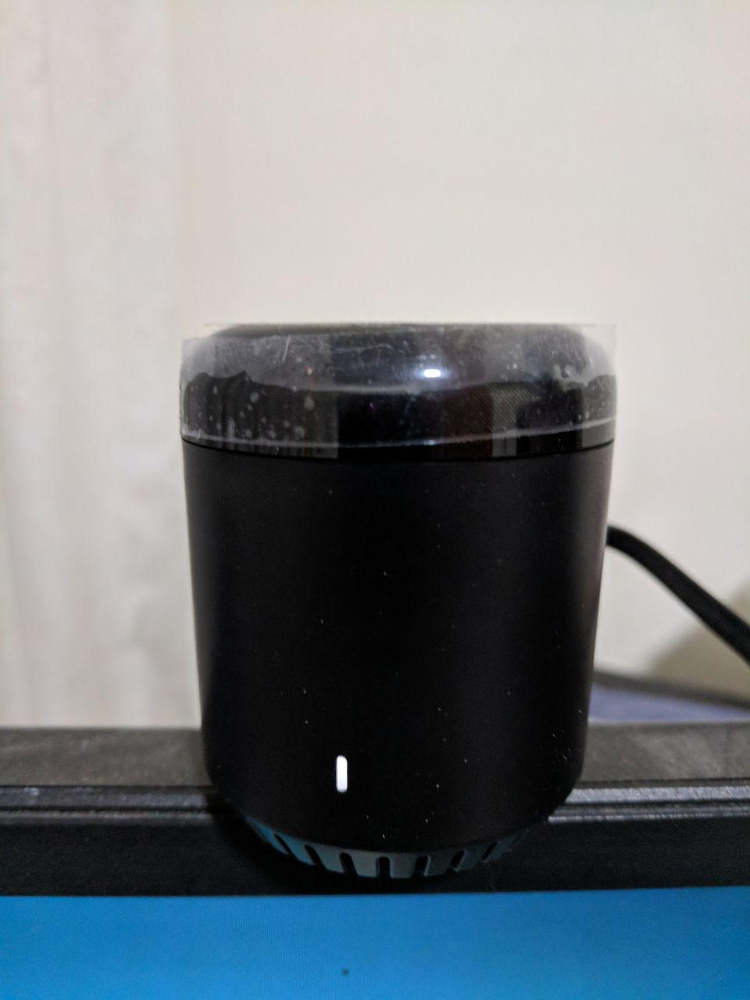

5. When it's white, point your IR remote controller to the top of the device and press the selected feature to learn the command
6. The `cli` app will print out the learned data, save this value in `commands.json` (See [Device's Commands](#device-commands) for more details on how to save learned command)
7. To test learned data with `python broadlink_cli --type <type> --host <host> --mac <mac address> --send <learned data>`


### Usage
#### Controlling devices
* Type `/keyboard` to begin
* First menu is to select the room 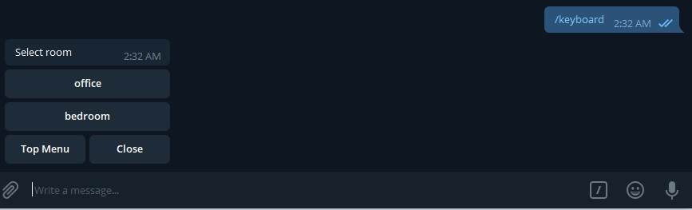
* After selecting the room, select the device in the room 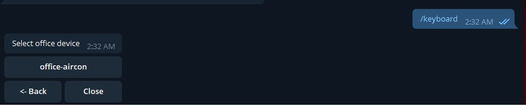
* The device's feature buttons will be shown 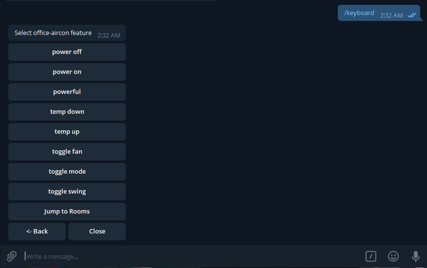
* On successful sent of the selected feature, the app will receive a feedback from the server
* eg. App
* 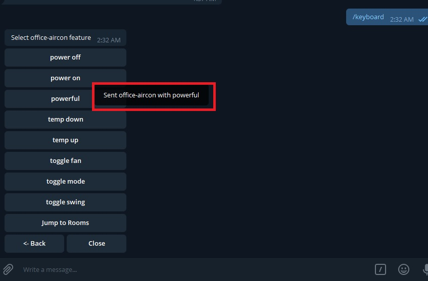
* eg. Mobile
* 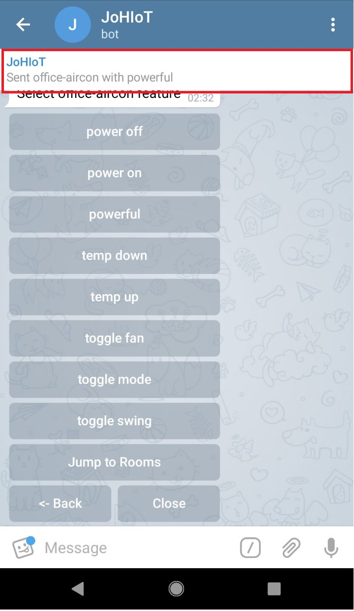
* Use `Back` or `Jump to Rooms` button to go back to previous menu or jump to select room menu
* To close, press the `Close` button and the menu keyboard will be closed


#### Add Users
* Conversation Flow (Start conversation -> input user's user_id -> input user's username -> Successfully added user)
* Type `/adduser` to begin
* Input the user's user id (The user may use `/ping` to find out user id)
* Input the user's user name
* Success!
* At any time if you wish to cancel adding user, you can type `/canceladduser` to cancel add user conversation
* Type `/user` or `/status` to check which user(s) are approved
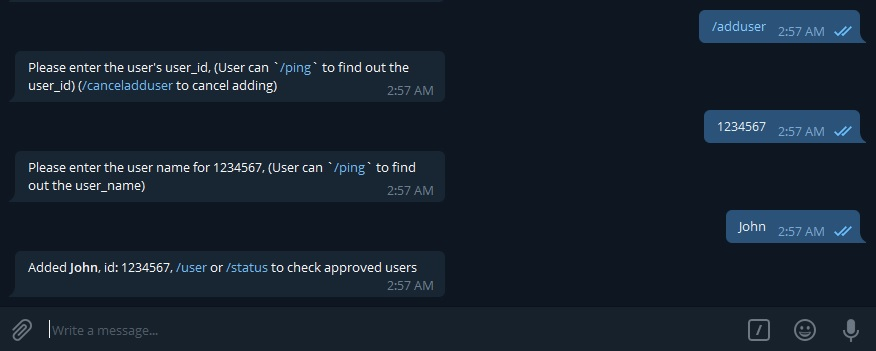

#### Remove Users
* Type `/user` to begin
* Select `Delete User` next to the user you want to remove
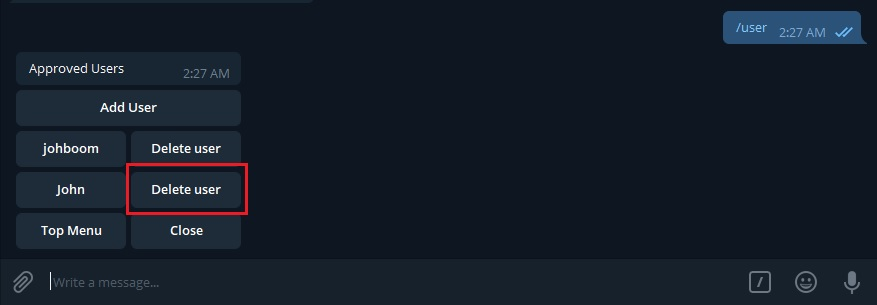
* Select `Yes` to confirm removal of the selected user or `No` to go back to user menu keyboard 
* On successful removal of selected user, the app will receive a feedback from the server stating the user's id and name that was removed
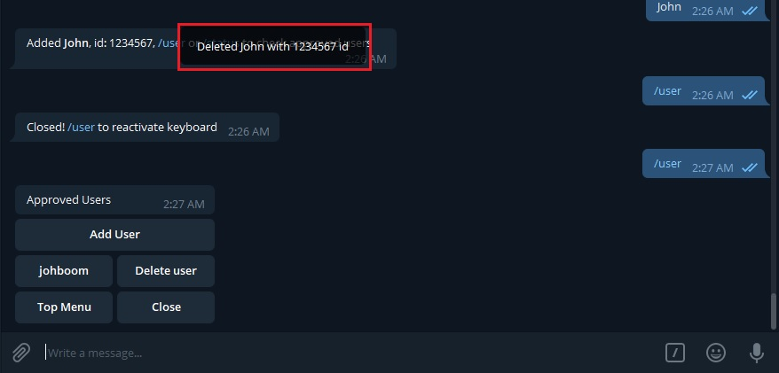
* To close, press the `Close` button and the user menu keyboard will be closed


# Run
1. Make sure you have Python 3.6++
1. Clone or fork the repository (https://github.com/joh90/iot)
1. `sudo apt-get install build-essential libssl-dev libffi-dev python3.6-dev` for Debian / Ubuntu
1. Install virtualenv (`pip3 install virtualenv`) (https://docs.python-guide.org/dev/virtualenvs/)
1. Create virtualenv for the repository (`python3 -m virtualenv <folder name>`)
1. Activate your virtualenv (`source <folder name>/bin/activate`)
1. Go to folder `cd iot`
1. Install requirements `pip3 install -r requirements.txt` (this might take some time)
1. Update `devices.json` with configuration
1. Add your telegram user to `users.json` (Refer to [Users](#users))
1. Run! ```python main.py --bot_id <BOT_ID> --bot_secret <BOT_SECRET> --name <Bot Name>```
1. You can pass your own users and devices json file, `python main.py --help` for more details
1. Find and add your bot to your Telegram
1. Enjoy!


# Screenshots
### Commands
#### Start (/start)
* Desktop App
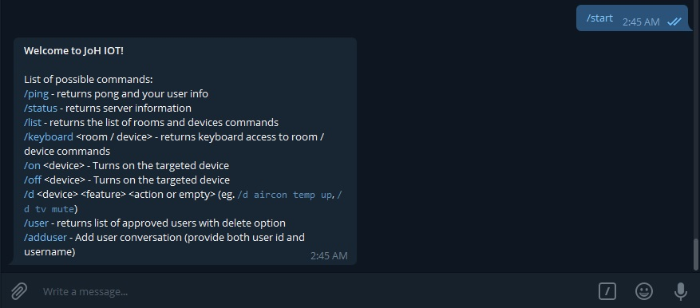
* Mobile App
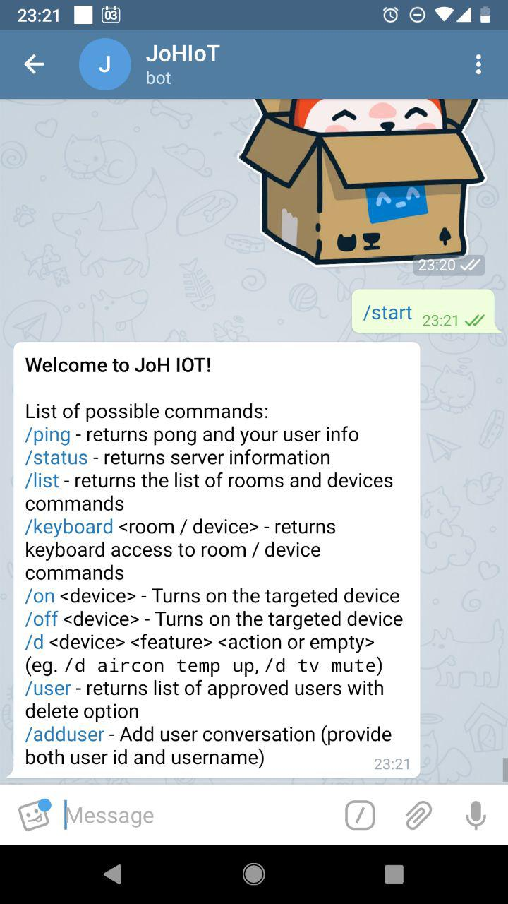

#### Ping (/ping)
* Desktop App


* Mobile App
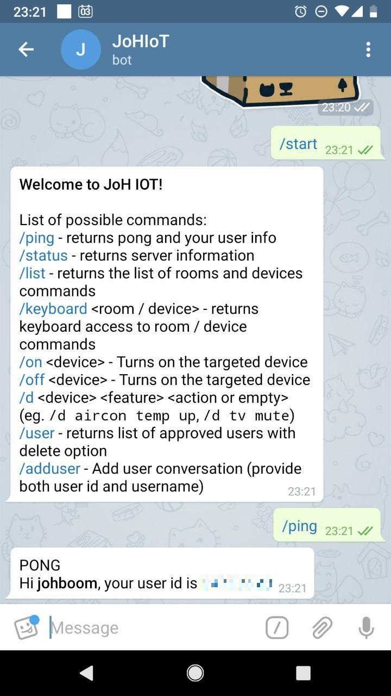

#### Status (/status)
* Desktop App
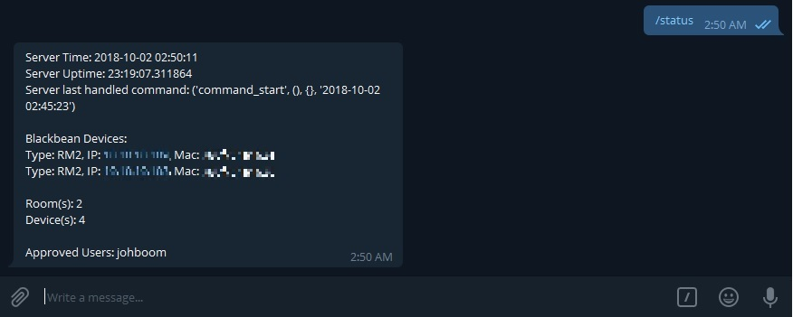

* Mobile App


#### List (/list)
* Desktop App
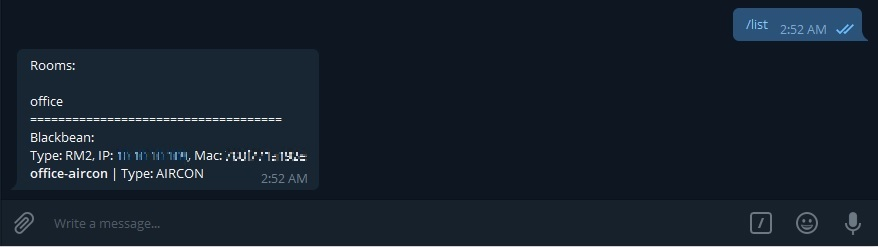

#### Keyboard (/keyboard)
* Desktop App


* Mobile App
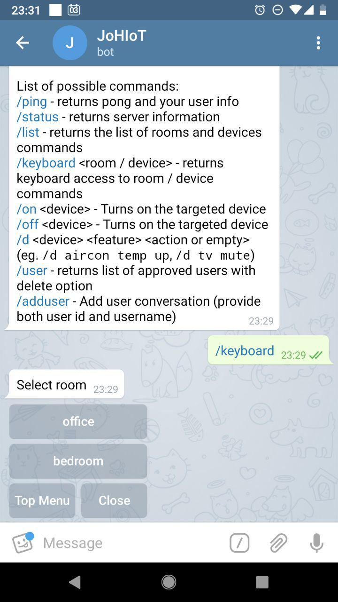
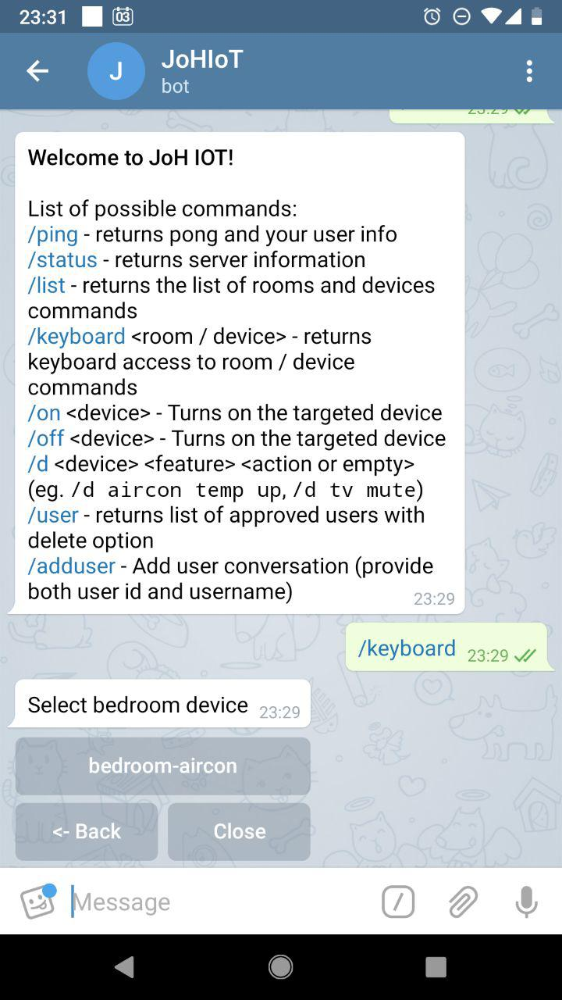
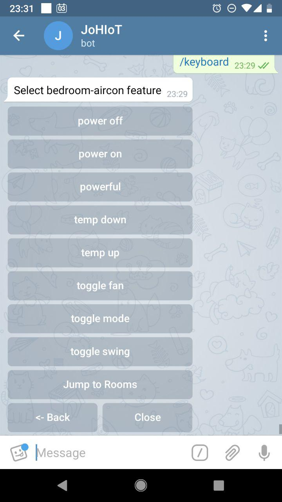

#### User (/user)
* Desktop App


* Mobile App
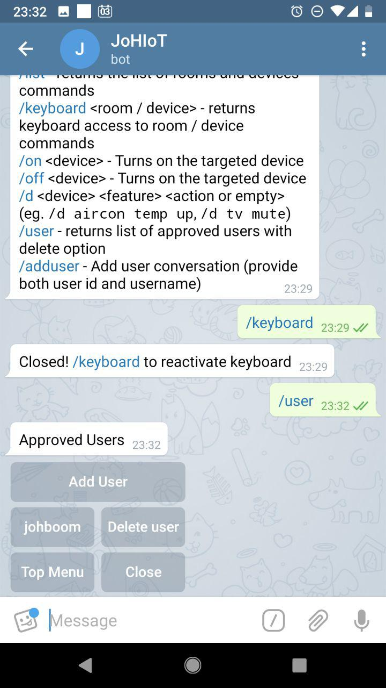


# Videos
### Turning on/off Aircon
**To be added**

### Turning on/off TV
**To be added**


# Future
### Minor Improvements
- [ ] Improve Room / Device listing
- [ ] Use 2 columns if Inline Keyboard menu buttons are more than 8
- [ ] On / Off device in room keyboard menu level
- [ ] Sort device's feature with power on and off first
- [ ] Send / Backup JSONs

### Major Features
- [ ] Room / User last command (with time)
- [ ] Custom Macros
- [ ] Favorite Keyboard, custom make your own keyboard buttons
- [ ] Room / Device CRUD (conversation style)
- [ ] Learn device command (conversation style) (+ if device command cannot be found / convo command)
- [ ] Set Top Box network provider channel bindings
- [ ] Support TC2 light switches
- [ ] Support Multimedia device's menu into up / down / left / right keyboard
- [ ] Support Broadlink power strip
- [ ] Restart server
- [ ] Triggers with scheduler (on specific day / time of day / repeatable to do something)


# Limitation
* You have to learn your own device's command if it is not available from the project
* With IR devices, the server will not be able to know the current state, only last send commands
* If the home / office's internet goes down, you will not be able to send command to your devices
* If your computer / Raspberry-PI hosting the server dies / restart, you will not be able to send command to your devices
* 2 devices in the same room may result in both devices receiving the IR commands sent from the server


# Contributing
* Fork the project
* Create branch in your fork project (from master)
* Make and test your changes
* Commit to the branch you created (with meaningful commit messages)
* From your fork project, create a pull request (with meaningful comments with purpose of the change)
* Fix comments from reviewers (if any)
* Admins will merge your pull request, when it has enough approval
* Thanks for contributing!

# License
* MIT License

Permission to use, copy, modify, and/or distribute this software for any
purpose with or without fee is hereby granted, provided that the above
copyright notice and this permission notice appear in all copies.
